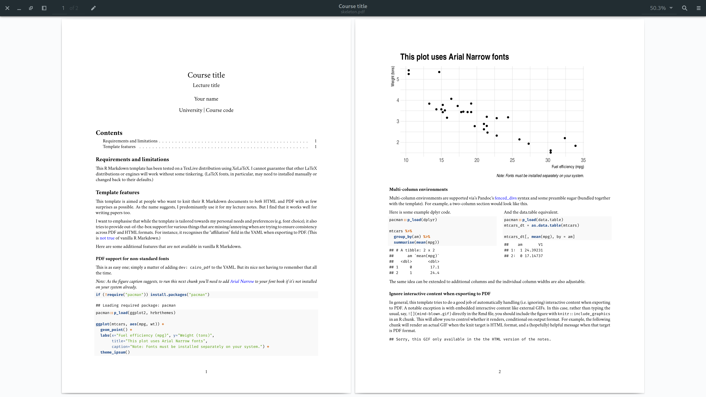

<!-- README.md is generated from README.Rmd. Please edit that file -->

# My lecture notes .Rmd template

<!-- badges: start -->

<!-- badges: end -->

The **lecturenotes** package provides a personalised .Rmd template that
I use for writing my lecture notes and research papers. It is intended
for documents that are going to be exported (i.e. “knitted”) to both
HTML and PDF formats. In so doing, it tries to take care of various
annoyances and inconsistencies that arise between these two formats. For
example:

  - Recognizing the author “affiliation” field in PDF documents.
  - Support for consistent multi-column environments in both HTML and
    PDF.
  - Support for non-standard fonts when knitting to PDF.
  - Sensible handling of interactive content depending on the output
    format.
  - Etc.

To get a sense of the resulting output, here are some screen grabs of
the knitted template:

1.  PDF ([live
    version](https://github.com/grantmcdermott/lecturenotes/blob/master/inst/rmarkdown/templates/template-name/skeleton/skeleton.pdf))
    

2.  HTML ([live
    version](http://raw.githack.com/grantmcdermott/lecturenotes/master/inst/rmarkdown/templates/template-name/skeleton/skeleton.html))
    

## Installation

I don’t foresee submitting this bespoke package to CRAN. However, you
can easily install it from GitHub:

``` r
# install.packages("remotes")
remotes::install_github("grantmcdermott/lecturenotes")
```

## Usage

Once the package is installed, open up the **lecturenotes** template in
RStudio by navigating to:

    File > New File > R Markdown > From Template > Lecture Notes

**Caveat:** Since this template was mostly designed for my own use, it
includes some opinionated takes on things like optimal fonts
(particularly LaTeX/PDF fonts). I’ve tried to mark clearly where you can
change things, but YMMV. Similarly, I’ve only tested this template on
TeXLive using XeLaTeX. I offer no guarantees that it will work on other
LaTeX distributions and/or engines.

## Acknowledgements

This package basically pulls together a bunch of tips, tricks, and ideas
that I’ve accumulated over time to fit my own idiosyncratic writing and
formatting needs. Some of these I stumbled upon on myself, most of them
I found the old-fashioned way: Searching on the Internet. Here is a
non-exhaustive list of helpful sources that I’ve drawn upon.

  - <http://labrtorian.com/2019/08/26/rmarkdown-template-that-manages-academic-affiliations>
  - <https://bookdown.org/yihui/rmarkdown-cookbook/multi-column-layout.html>
  - <https://pandoc.org/MANUAL.html#extension-fenced_divs>
  - <https://tex.stackexchange.com/q/135361>
